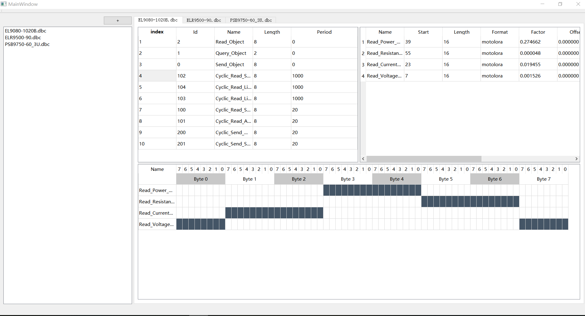

# DbcParser

[![Qt][qt-img]][qt]

## 简介
该工程目前提供了对DBC文件的解析功能，并将解析器封装在了Parser类中，接口独立，方便第三方集成调用。

## TODO  
- [x] dbc文件读取
- [x] dbc文件解析
- [x] bit位预览
- [ ] dbc文件编辑
- [ ] dbc文件导出
- [ ] 对接can打开、接收、发送和关闭接口